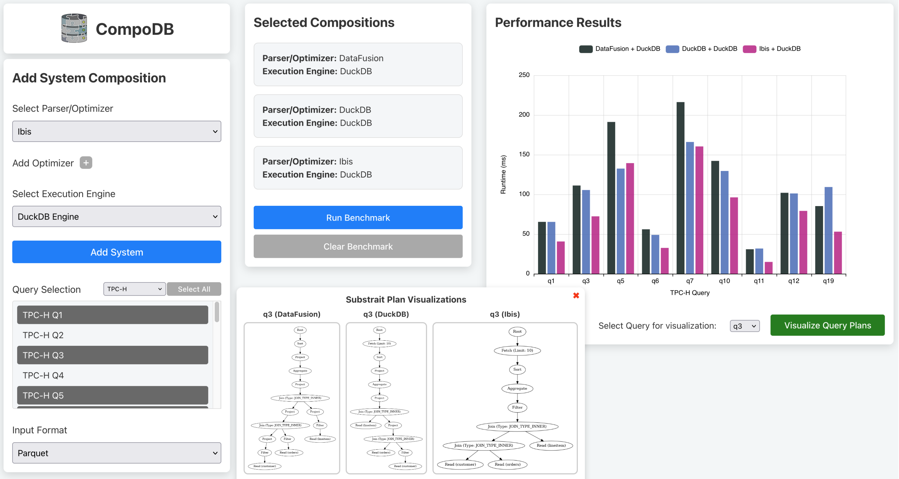

### Demo UI

The Demo UI is a single page application that lets users play with and test the CompoDB core functionality. 
The SPA is written in Vue.js and is started on setup in its own docker frontend container. The scope is simple as there 
are only components for the modular structure of the page nested in a grid. The visualizations of the query plans are 
implemented as a popup window.

