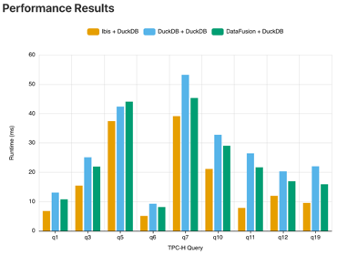
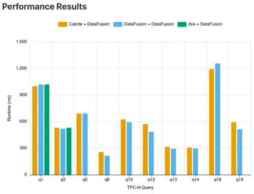
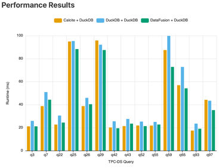
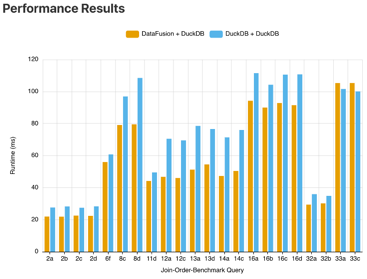
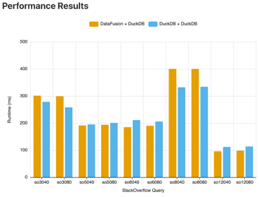

### Outcomes

After extensive benchmarking, the following lists some interesting outcomes:

#### TPC-H DuckDB Demo

| CompoDB | Parser / Optimizer | Execution Engine |
|---------|--------------------|------------------|
| # 1     | Ibis               | DuckDB           |
| # 2     | DuckDB             | DuckDB           |
| # 3     | DataFusion         | DuckDB           |

**Note:** Pythonic Ibis queries generally deliver the best performance compared to other optimizers. In most cases, 
DataFusion-optimized plans outperform DuckDB’s own optimizer when running on DuckDB, with the exception of query 5.

#### TPC-H DataFusion Demo

| CompoDB | Parser / Optimizer | Execution Engine |
|---------|--------------------|------------------|
| # 1     | Calcite            | DataFusion       |
| # 2     | DataFusion         | DataFusion       |
| # 3     | Ibis               | DataFusion       |

**Note:** On DataFusion’s engine, the various query plans tend to perform similarly overall. Calcite shows a potential 
advantage on query 18, while Pythonic Ibis plans have little impact in this context, as they are rarely executed here 
anyway.

#### TPC-DS DuckDB Demo

| CompoDB | Parser / Optimizer | Execution Engine |
|---------|--------------------|------------------|
| # 1     | Calcite            | DuckDB           |
| # 2     | DuckDB             | DuckDB           |
| # 3     | DataFusion         | DuckDB           |

**Note:** On DuckDB’s engine, query plans optimized by Calcite and DataFusion generally outperform those produced by 
DuckDB’s own optimizer. The visualized plans highlight clear and significant differences between the approaches.

#### Join-Order-Benchmark DuckDB Demo

| CompoDB | Parser / Optimizer | Execution Engine |
|---------|--------------------|------------------|
| # 1     | DataFusion         | DuckDB           |
| # 2     | DuckDB             | DuckDB           |

**Note:** Combining DataFusion’s optimizer with DuckDB’s execution engine yields strong performance across nearly all 
queries—often up to 40% faster than DuckDB’s own plans, particularly for queries 12x, 13x, and 14x. These also make for 
great visual examples due to the clear differences in plan structure.

However, for query 33x, DuckDB’s optimizer has the edge. Its bushy execution plan outperforms DataFusion’s left-deep 
plan, likely because these queries access multiple instances of the same table (e.g., info_type it1, info_type it2, 
etc.).

#### StackOverflow DuckDB Demo

| CompoDB | Parser / Optimizer | Execution Engine |
|---------|--------------------|------------------|
| # 1     | DataFusion         | DuckDB           |
| # 2     | DuckDB             | DuckDB           |

**Note:** Performance varies depending on the query: some run faster with the DuckDB+DuckDB combination, while others 
benefit more from the DataFusion+DuckDB setup.

Notably, queries like so60XX and so12XXX highlight how DuckDB paired with DataFusion’s optimizer can lead to more 
efficient execution plans. In contrast, queries such as so30XX and so80XX perform better with DuckDB’s own optimizer. 
For example, so3040 reveals a notably bushy plan from DuckDB compared to DataFusion’s more left-deep strategy—likely 
due to multiple references to the same table (e.g., question q1, question q2, etc.).