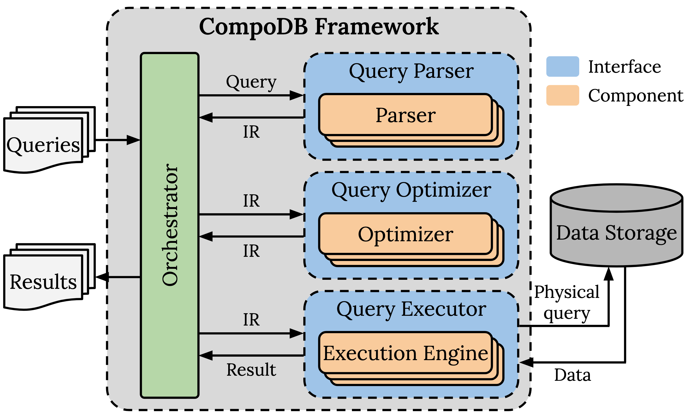

### CompoDB - Architecture

At its core, the framework provides interfaces and functionality that 
connects components and lets users coordinate their query execution easily. 
It allows users to compose unique systems tailored to their
workload requirements by selecting a combination of components, 
which communicate using a common IR. The user can process queries 
by submitting their native queries to the parser of their choice and 
proceeding with a sequence of optimizing and finally execution steps with 
the received intermediate query representation.

<div style="text-align: center;">

</div>

The core structure can be found under `compodb-core/src` which contains the main entity 
of CompoDB as the `class CompoDB`, which wraps all inherent components into an 
individual DMS when instantiated and tracks the currently existing compositions. It also contains the `class DBContext`, 
which holds the data/file paths and provides functionality to register tables centrally for 
all components. \
For each component type query parser, query optimizer or query executor a respective interface is 
defined:

```python
# Query Parser

class Parser(ABC):
    
    @abstractmethod
    def to_substrait(self, native_query: str) -> str:
        pass
    
    @abstractmethod
    def register_table(self, table_path: str) -> None:
        pass
    
    @abstractmethod
    def get_name(self) -> str:
        pass

    
# Query Optimizer

class Optimizer(ABC):

    @abstractmethod
    def optimize_substrait(self, substrait_query: str) -> str:
        pass

    @abstractmethod
    def register_table(self, table_path: str) -> None:
        pass

    @abstractmethod
    def get_name(self) -> str:
        pass


# Query Executor

class ExecutionEngine(ABC):

    @abstractmethod
    def run_substrait(self, substrait_query: str):
        pass

    @abstractmethod
    def register_table(self, table_path: str) -> None:
        pass

    @abstractmethod
    def get_name(self) -> str:
        pass
```

The parser interface defines a `to_substrait` method that takes in a native (sql/pythonic) query and 
produces an intermediate representation of the query in the form of a Substrait plan. \
The optimizer interface defines a `optimize_substrait` method that takes in a Substrait plan and 
returns an optimized version of the query plan. \
The execution engine interface defines a `run_substrait` method that takes in a Substrait plan and executes 
it their pre-defined context. \
Additionally, all components have to implement a `register_table` and `get_name` method to create individual 
contexts and be identifiable.

Data is provided by parquet or csv files on disk and are referenced by integrating the files under `compodb-core/data`.

The user interface is currently limited to a http REST API under `compodb-core/connectors/http` and comprises 
routes to:
- Create a new CompoDB instance: `@router.post("/new-compodb")` based on the following json structure:
    ```python
  class CompoDB(BaseModel):
        parser: str
        optimizer: List[str]
        executionEngine: str
  ```
- Run queries (based on a specific benchmark or individual): `@router.post("/run-benchmark")` based on the following 
json structure:
    ```python
  class Benchmark(BaseModel):
        compoDBs: List[CompoDB]
        queries: List[str]
        inputFormat: str
  ```
- Visualize a Substrait plan: `@router.post("/visualize-substrait")` based on the following json structure:
    ```python
  class QueryData(BaseModel):
        query_name: str
        parser_name: str
        query_plan: str
  ```
- Clear the current state of the system: `@router.post("/clear")`