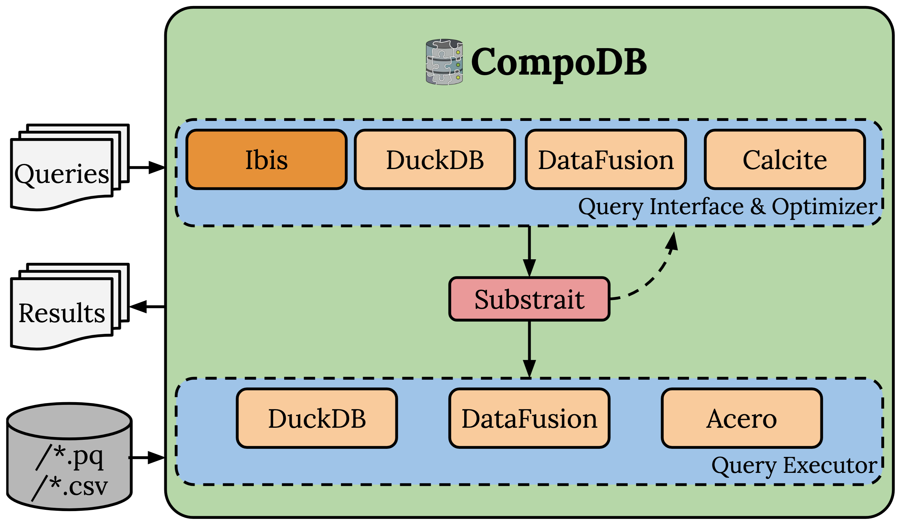

### Procedures

When setting up the project, the REST application currently initiates all benchmark setups on startup. 
This includes data generation and registration of tables. Pre-defined benchmark queries are integrated in 
the project and can be found at `compodb-core/tests/queries`. Ultimately, the user selects which compositions 
should be used by specifying the components from the options pool, provides the data files to be run on and calls 
queries on this state. 

An exemplary execution at runtime can look like:

1. Individual specialized CompoDB instances are created through the defined route, which contain all specified components. 
These are stored in the system until the state is cleared.
2. Through the database context `DBContext` the data files can be registered for the CompoDB instances. This is currently 
limited to the individual benchmark implementations but can easily be extended.
3. Through the respective `/run-benchmark` route a number of queries can be run on any selected CompoDB instance created. 
This can be done by either naming pre-defined benchmark queries or handing over individual SQL queries and specifying 
the CompoDB instances that should run those in the previously described json format.
4. The current response format also contains the Substrait plan that was used, which then can be used to call the 
visualizer route, to get a visual representation of the query plan.
5. By using the `/clear` route, all CompoDB instances and data file links are deleted to reset the context for new 
work.

